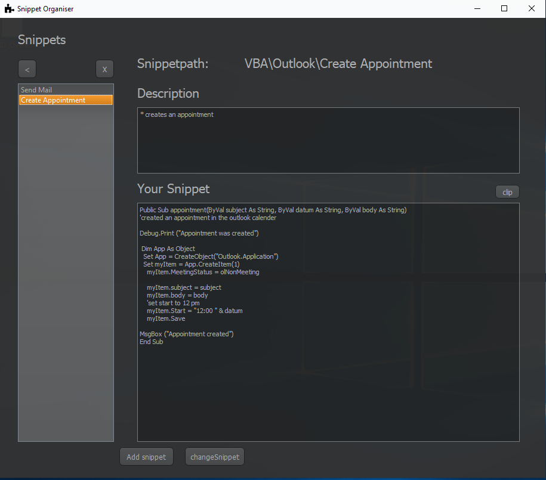

# SnippetOrganiser
Organise your snippets within a desktop application
Snippets are listed by:
    - their programming language
    - their Category: organised as Folder (first line of your description)
    - their title



## Execute
```
python3 ./snippetOrganiser.py
```

## Dependencies
* Python 3.x
* PyQt5.x
* Gitlab API Token
* (Pyinstaller)


### Create Gitlab API Token
* Login into Gitlab
* Goto settings on the right top
* select the category on the left side called "access token"
* Enter your name and check the box called "api"
* Enter create personal access token and the token will appear


### Create Executable with Pyinstaller
#### From the command line
```
pyinstaller .\snippetOrganiser.py --add-data "pic.png:pic.png" --onefile --noconsole --icon=[path]
```
#### With the snippetOrganiser.spec file:
```
pyinstaller .\snippetOrganiser.spec
```
